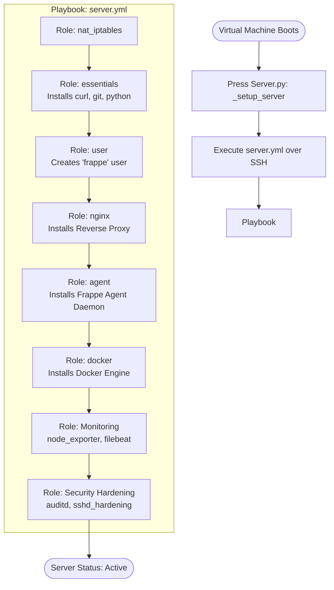

# Ansible Flowcharts

Press utilizes `ansible-runner` to programmatically execute playbooks directly from Python code. This usually happens immediately after a Virtual Machine finishes booting.

## Server Provisioning Flow (`server.yml`)

The primary playbook used to set up a brand new managed server is `press/playbooks/server.yml`.

## Secondary Playbooks

Press also maintains specialized playbooks for different server types:

*   `self_hosted.yml`: Used when a user brings their own hardware. It bypasses cloud-specific volume mounting and network assumptions.
*   `update_agent.yml`: Used strictly to fetch the latest agent code from Git and restart the systemd service.
*   `mysql.yml`: Sets up MariaDB 10.6, tuning InnoDB buffers based on the server's RAM.