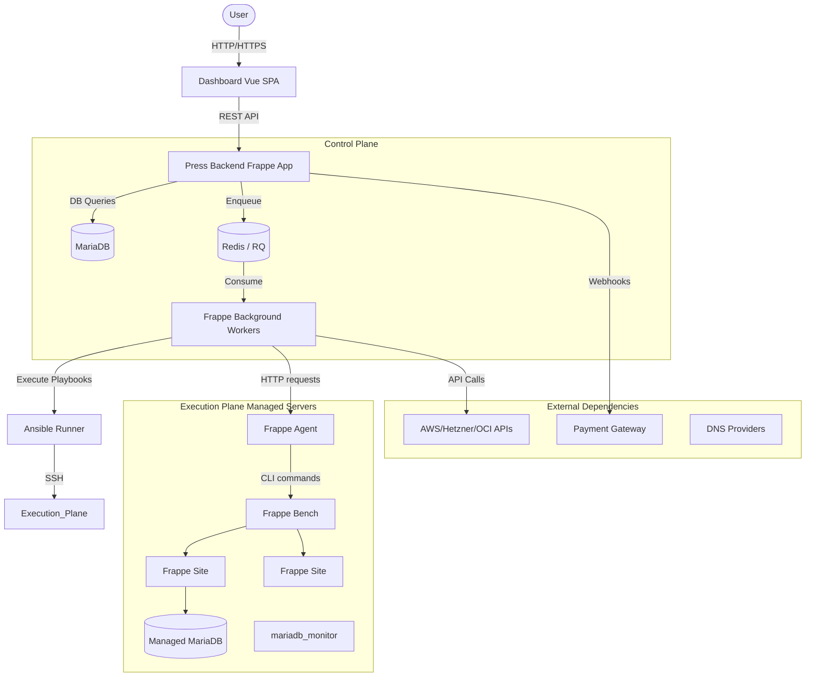

# System Architecture

Press relies on a distributed architecture to manage infrastructure, orchestrate site lifecycle events, and provide a user-friendly interface.

## High-Level Architecture

## Component Details

### 1. Press Backend (Frappe App)
*   **Role:** The centralized control plane.
*   **Responsibilities:**
    *   Maintains the canonical state of the system (Sites, Servers, Teams, Subscriptions).
    *   Exposes APIs (`press/api/` and `run_doc_method`) for the Dashboard.
    *   Handles billing, permissions, and routing.
    *   Orchestrates async jobs (Agent Jobs) via Frappe's background workers.
*   **Dependencies:** Runs on Frappe framework, requires MariaDB and Redis. Connects to external services (AWS, DNS providers, Stripe).

### 2. Dashboard (Vue SPA)
*   **Role:** The frontend interface for tenants.
*   **Responsibilities:** Provides a UI for users to manage their sites, benches, servers, and billing without requiring Frappe Desk access.
*   **Communication:** Communicates with the Press Backend exclusively via HTTP REST calls, utilizing `frappeRequest`.

### 3. Frappe Agent (`press/agent.py`)
*   **Role:** The execution plane daemon residing on managed servers.
*   **Responsibilities:**
    *   Listens for HTTP POST/DELETE requests from the Press Backend.
    *   Executes local commands (e.g., `bench new-site`, `bench backup`, app installations).
    *   Reports job execution status and logs back to Press.
*   **Authentication:** Authenticates requests using tokens/passwords stored in the Press Backend's `Server` DocType.

### 4. Ansible (`press/playbooks/`, `press/runner.py`)
*   **Role:** Infrastructure configuration management.
*   **Responsibilities:**
    *   Provisions raw virtual machines (installing Docker, NGINX, Python, MariaDB).
    *   Applies security hardening, firewall rules, and mounts volumes.
    *   Installs and updates the Frappe Agent.
*   **Execution:** Press uses `ansible-runner` (via the `Ansible` class) within background workers to execute playbooks over SSH.

### 5. Backbone / Cloud Integrations (`press/press/doctype/virtual_machine/`)
*   **Role:** Cloud Infrastructure Management.
*   **Responsibilities:** Interacts with cloud provider APIs (AWS Boto3, Hetzner HCloud, Scaleway, OCI) to create instances, manage IP addresses, resize disks, and take snapshots.

### 6. Operational Libs (`libs/`)
*   **Role:** System reliability and edge-case handling.
*   **Components:**
    *   `mariadb_monitor`: A Go daemon that monitors system memory (PSI, swap, OOM) and gracefully recovers MariaDB instances under pressure by killing safe processes or safely restarting the DB.
    *   `fcrestore`: A CLI tool for migrating large sites efficiently.
    *   `filewarmer`: Pre-warms specific files on disk.

## Runtime Architecture

*   **API Requests:** Incoming user actions hit the Frappe gunicorn web workers. The web worker updates the database and enqueues a job.
*   **Background Jobs:** Long-running tasks (like talking to the Agent or running Ansible) are offloaded to Python RQ workers (Frappe's default background job system).
*   **Scheduled Jobs:** Press heavily utilizes Frappe's `hooks.py` scheduler (cron-like) to execute periodic tasks. The most critical is `poll_pending_jobs`, which continuously checks the status of tasks dispatched to Agents.
