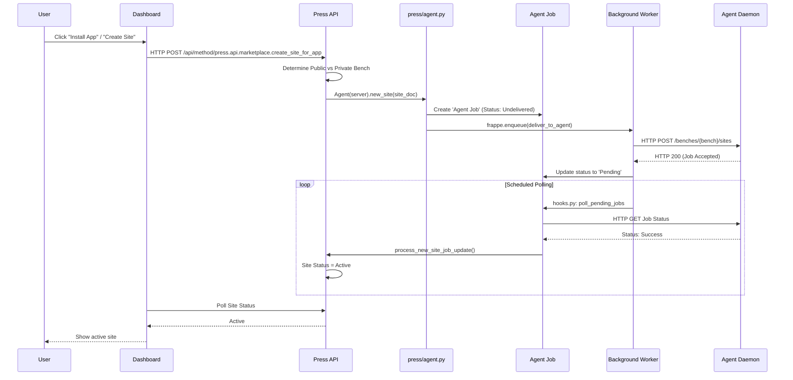

# Workflows

This document traces the exact execution path of critical workflows in Press, from the initial trigger down to the server-level execution and back.

## 1. Site Creation

This workflow is triggered when a user installs an app or signs up for a SaaS product trial, requesting a new Frappe site.

**Implementation Details:**
1.  **Trigger:** `dashboard/src/pages/InstallApp.vue:298` calls `frappeRequest({ url: 'press.api.marketplace.create_site_for_app', ... })`.
2.  **API Handler:** `press/api/marketplace.py:33` (`create_site_for_app`) routes to `create_site_on_public_bench` or `create_site_on_private_bench`.
3.  **Site Creation:** A `Site` DocType is inserted.
4.  **Agent Invocation:** `press/press/doctype/site/site.py:1200` calls `Agent(self.server).new_site(self)`.
5.  **Job Creation:** `press/agent.py:142` (`new_site`) calls `create_agent_job("New Site", f"benches/{site.bench}/sites")`. This creates an `Agent Job` DocType in "Undelivered" state.
6.  **Delivery:** The job is enqueued to `deliver_to_agent` which makes the actual HTTP POST to the agent daemon.
7.  **Polling:** `press/press/doctype/agent_job/agent_job.py:279` (`poll_pending_jobs`) runs every minute (via `hooks.py`), querying the Agent for completion.
8.  **Callback:** Once the Agent reports success, `process_new_site_job_update()` (`press/press/doctype/site/site.py:4628`) is called, marking the Site as "Active".

## 2. Server Provisioning

This workflow occurs when a user requests a dedicated virtual machine.

1.  **Trigger:** A new `Virtual Machine` DocType is created (e.g., via a Site Plan purchase).
2.  **Cloud API:** `press/press/doctype/virtual_machine/virtual_machine.py:534` (`self.client().provision_virtual_machine(...)`) makes an API call to the cloud provider (AWS/Hetzner) to boot the instance using a cloud-init script.
3.  **Server Record:** A `Server` DocType is created, and `setup_server()` is called.
4.  **Ansible Enqueue:** `press/press/doctype/server/server.py:860` sets status to "Installing" and enqueues `_setup_server`.
5.  **Playbook Execution:** `_setup_server` initializes `Ansible(playbook="server.yml", server=self)` (`press/runner.py:200`) and executes it.
6.  **Result:** The playbook installs dependencies, Docker, and the Agent. Upon success, the Server status becomes "Active".

## 3. Site Backup

1.  **Trigger:** Scheduled via `hooks.py` calling `schedule_logical_backups` or `schedule_physical_backups` in `press/press/doctype/site/backups.py`.
2.  **Agent Invocation:** Creates an `Agent Job` of type "Backup Site".
3.  **Execution:** The Agent runs `bench --site {site} backup`.
4.  **Callback:** The Agent uploads the backup to S3 and returns the URL. Press creates `Remote File` records and a `Site Backup` record.

## 4. Agent Update

Used by operators to update the Agent version across fleets.

1.  **Trigger:** Operator uses the "Agent Update" tool.
2.  **Execution:** Enqueues `_update_agent_ansible` on the Server DocType.
3.  **Ansible:** Runs the `update_agent.yml` playbook, which pulls the new commit, restarts the agent service, and verifies it comes back online.
